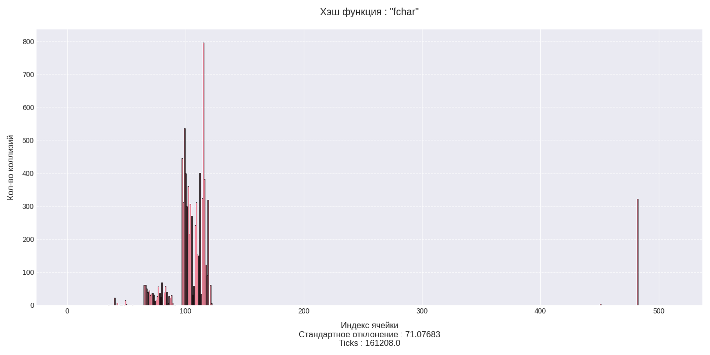

# Оптимизация работы хэш-таблицы с использованием профилирования

- [Оптимизация работы хэш-таблицы с использованием профилирования](#оптимизация-работы-хэш-таблицы-с-использованием-профилирования)
  - [Аннотация](#аннотация)
  - [Входные данные](#входные-данные)
  - [Методика работы](#методика-работы)
    - [Среда](#среда)
  - [Инструменты](#инструменты)
    - [Ход работы](#ход-работы)
      - [1. __Профилирование__](#1-профилирование)
      - [2. __Анализ `perf hist`__](#2-анализ-perf-hist)
      - [3. __Измерение времени работы версий:__](#3-измерение-времени-работы-версий)
        - [3.1 __Разогрев (`Warm-up`):__](#31-разогрев-warm-up)
        - [3.2 __Основные замеры:__](#32-основные-замеры)
      - [4. __Обработка результатов__](#4-обработка-результатов)
  - [Исследование функций хэширования](#исследование-функций-хэширования)
    - [Хэш-функция : "Первый символ"](#хэш-функция--первый-символ)
    - [Хэш-функция : "Полиномиальная"](#хэш-функция--полиномиальная)
    - [Хэш-функция : "FNV (Fowler–Noll–Vo)"](#хэш-функция--fnv-fowlernollvo)
    - [Хэш-функция : "crc32"](#хэш-функция--crc32)
    - [Хэш-функция : "crc32\_intrinsic"](#хэш-функция--crc32_intrinsic)
  - [Итоговые результаты сравнения](#итоговые-результаты-сравнения)
  - [Оптимизации хэш-таблицы](#оптимизации-хэш-таблицы)
    - [Версия `v0`](#версия-v0)
    - [Версия `v1`](#версия-v1)
    - [Версия `v2`](#версия-v2)
    - [Версия `v3`](#версия-v3)
    - [Версия `v4`](#версия-v4)
- [Заключение](#заключение)
  - [Итоговые результаты:](#итоговые-результаты)
- [Анализ ошибок](#анализ-ошибок)
  - [1. Отсутствие алгоритмического анализа перед началом оптимизаций](#1-отсутствие-алгоритмического-анализа-перед-началом-оптимизаций)
    - [Версия bad\_v1](#версия-bad_v1)
    - [Версия bad\_v4](#версия-bad_v4)
    - [Версия omg\_v5](#версия-omg_v5)
    - [Вывод](#вывод)
  - [2. Неаккуратный бенчмаркинг](#2-неаккуратный-бенчмаркинг)
    - [Вывод](#вывод-1)

## Аннотация
Хэш-таблица - это структура данных, позволяющая хранить пары (ключ, значение) и выполнять три операции: операцию добавления новой пары, операцию поиска и операцию удаления пары по ключу.


При добавлении новой пары благодаря хэш-функции ключ преобразуется в индекс массива. При хэшировании ключа возможно возникновение __коллизии__ - ситуации, в которой двум различным ключам сопоставляется одна ячейка массива. В этом случае производится проход по односвязному списку, находящемуся в данной ячейке массива, и явное сравнение ключей вершин списка и добавляемого ключа. При отсутствия совпадения, новая пара добавляется в конец односвязного списка.


В данной работе была реализована хэш-таблица с разрешение коллизий с помощью цепочек. Структура таблицы представляет из себя массив односвязных списков, в каждой вершине которого хранятся пары (ключ, значение). В данной работе не используется значение пары, поэтому его нет в структурах.


Заранее сообщу, что в данной работе реализация хэш-таблицы опирается на ограничение входных данных (все обрабатываемые слова имеют длину не более 32 символов). Чтобы подчеркнуть этот важный момент, в названия стандартных функций и структур добавлен префикс `32b` (32 байта - максимальный размер слова).

```c++
// Структура хэш таблицы:

struct list_node_t {
    const char *key;
    list_node_t* next;
};

struct hash_table_32b_t {
    size_t sz;
    hash_function_t hash_function;
    list_node_t **data;
};
```


```c++
bool hash_table_32b_insert_key(hash_table_32b_t *hash_table, const char key_32b[]) {
    uint64_t table_idx = hash_table->hash_function(key_32b) % hash_table->sz;

    list_node_t *cur_node = hash_table->data[table_idx];
    list_node_t *last_node = NULL;

    while (cur_node) {
        last_node = cur_node;
        if (strncmp(key_32b, cur_node->key, 32) == 0) return true;
        cur_node = cur_node->next;
    }

    list_node_t *new_node = list_node_t_ctor(key_32b);

    if (last_node) last_node->next = new_node;
    else hash_table->data[table_idx] = new_node;

    return true;
}
```

Операции поиска схожа с операцией добавления, за исключением того, что при обнаружении совпадения в проходе по односвязному списку возвращается найденная вершина.

```c++
list_node_t *hash_table_32b_find_key(hash_table_32b_t *hash_table, const char key_32b[]) {

    list_node_t *cur_node = hash_table->data[table_idx];
    while (cur_node) {
       if (strncmp(key_32b, cur_node->key, 32) == 0) return cur_node;

        cur_node = cur_node->next;
    }

    return NULL;
}
```


В данной работе исследуются приемы оптимизации хеш-таблицы, реализованной методом цепочек. Основная цель — выявить «горячие» участки кода с помощью профилирования и улучшить их производительность за счет использования низкоуровневых техник, таких как ассемблерные вставки, `intrinsics`, реализация функций на `nasm`.

Оптимизации будут проводиться итеративно. Каждая новая версия проекта будет включать в себя оптимизации предыдущей:
* `v1` - версия без оптимизаций
* `v2` - версия с оптимизациями компилятора
* `v3` - версия с intrinsic оптимизацией функции crc32
* `v4` - версия с использованием собственной реализацией функции streq на ассемблере
* `v5` - версия с использованием inline функции streq с ассемблерными вставками


## Входные данные
Перед началом тестирования хэш таблицы требуется сгенерировать входные данные. В качестве исходника для входных данных был взят текст романа Л. Н. Толстого "Война и мир", находящийся в файле `war_and_peace.txt`.

Подготовленными входными данными являются:
* Список слов для загрузки в хэш таблицу `text.txt`
* Список слов для тестирования хэш таблицы `tests.txt`

Для исследования оптимизаций хэш-таблицы установим:
* Длину каждого списка из входных данных в `40000` слов
* Размер хэш-таблицы в `512` ячеек

Данные константы были подобраны для того, чтобы `load factor` хэш-таблицы был равен `≈15`. В реальности данное значение `load factor` слишком велико и может привести к длительному линейному поиску в односвязном списке. В данной работе `load factor` был взят неоптимальным в учебных целях : для возможности применения эффективных оптимизации к функции `strncmp` и достоверного исследования хеш-функции на частоту коллизий.

Для генерации входных данных используйте команду:

```bash
    python3 run.py gen_tests
```

После выполнения команды будет создана папка `data` с файлами `text.txt` и `tests.txt` с необходимыми входными данными.


## Методика работы

### Среда
* __Процессор:__ Intel Core i5-10300H 2.5GHz
* __Оперативная память:__ 8Gb
* __Кэш память__
    * __L1__ : 256 Kb
    * __L2__ : 1 Mb
    * __L3__ : 8 Mb
* __Компилятор:__ g++ 13.3.0
* __Среда:__ Ubuntu 24.04

## Инструменты
* __Профилирование:__ perf, hotspot
* __Сборка:__ makefile, python

### Ход работы

#### 1. __Профилирование__

Профилирование выполняется с помощью `perf` с флагами:
```bash
perf record -g --call-graph dwarf -e branch-misses,cache-misses,instructions,cycles -T -F 100000 -- <исполняемый файл> <флаги исполняемого файла>
```

* Для увеличения количества `samples` рекомендуется добавить в <флаги исполняемого файла> : `--measures=100`
* `-g` - включает запись call graph для каждого семпла
* `--call-graph dwarf` - выбирает технологию `dwarf` сбора данных для `--call-graph`. При выборе `dwarf` `perf` дополнительно к исполняемой программе поддерживает стековую память самостоятельно. Эта технология имеет ограничение на глубину стека и требует больше ресурсов, __но__ позволяет анализировать программы, в которых в целях оптимизации не всегда создается стековый фрейм (см. `-fno-omit-frame-pointer`).
* `-T | --timestamp` - записывает временные метки (таймстемпы) для каждого семпла. Это позволяет в дальнейшем выводить точное время появления каждого события (например, с помощью perf report -D)
* `-F | --freq` - задаёт частоту семплирования — количество семплов в секунду

#### 2. __Анализ `perf hist`__

Для анализа `perf hist` используется команда
```bash
perf report --call-graph fractal,caller -i <путь до perf.data>
```

* fractal — формат, в котором проценты нормализуются относительно каждого родителя (каждая ветка дерева рассматривается отдельно). Используется этот формат, чтобы оценить влияние оптимизируемых функций только на измеряемую часть работы хэш-таблицы (`поиск`), а не на всю работу программы целиком.
* caller — порядок отображения "родитель → потомок"

#### 3. __Измерение времени работы версий:__

##### 3.1 __Разогрев (`Warm-up`):__

Перед основными измерениями выполняется серия холостых вызовов функции find_key, прогревающая кэш и предсказатель ветвлений.
```c++
for (size_t j = 0; j < measure_warm_up_repeats; j++) { // разогрев
    [[maybe_unused]] list_node_t *read_key_res = hash_table_32b_find_key(hash_table, key_32b);
    assert(read_key_res);
}

tick_start = __rdtsc();
[[maybe_unused]] list_node_t *read_key_res = hash_table_32b_find_key(hash_table, key_32b);
assert(read_key_res);
tick_end = __rdtsc();
duration->tick_point += (tick_end - tick_start);
```

##### 3.2 __Основные замеры:__

Для каждой версии проекта выполняется несколько измерений времени выполнения всех операций `find_key` на тестах из входных данных.

Выставить длину серии холостых вызовов и количество измерений на каждую версию можно в `configs/benchmarks.yaml`. Для того, чтобы версии тестировались в наиболее приближенных условиях рекомендуется выставлять одинаковые значения в полях, отвечающих за количество измерений на каждую версию.


#### 4. __Обработка результатов__

Итоговые результаты бенчмаркинга генерируются с учетом погрешности ($x_{mean} \pm \sigma_{x_{mean}}$). Выбросы убираются по правилу $3‑σ$.
При расчете использовались формулы:

$$x_{mean} = \frac{\Sigma_{1}^{N}x_i}{n} $$

$$s = \sqrt{\frac{1}{N - 1}\Sigma_{1}^{N}(x_i - x_{mean})^2}$$

$$\sigma_{x_{mean}} = \frac{s}{\sqrt{N}}$$

Для запуска процесса измерения версий нужно написать команду:
```bash
python3 run.py vbench
```
После завершения работы скрипта в файле `results/versions_benchmarks` появятся результаты измерений версий. Рядом с каждым результатом измерений будет выведена информация об относительной погрешности:
`(error : XX.XX%)`.
Высокое значение `error` сигнализирует о возможной недостоверности измерений. Для уменьшения относительной погрешности рекомендуется увеличить значения в полях, отвечающих за количество измерений на каждую версию в файле `configs/benchmarks.yaml`.

## Исследование функций хэширования
Перед началом процесса оптимизации рассмотрим несколько хэш-функций и отберем самую лучшую.
Все хэш-функции имеют сигнатуру
```c++
uint64_t hash_function(const char key[]);
```
Выбор самой лучшей хэш-функции будет определятся несколькими критериями:
* __Величина стандартного распределения коллизий__. Чем меньше величина, тем равномернее будут распределяться значения по хэш-таблице, что будет способствовать ускорению поиска значений.
* __intrinsic Поддержка__. Для некоторых хэш-функций были созданы `intrinsics`, использование которых значительно ускоряет их работу.

### Хэш-функция : "Первый символ"

__Реализация__
```c++
uint64_t first_char_hash_func(const char key[]) {
    return (uint64_t) key[0];
}
```

__График коллизий__



__Параметры__
|                        |        |
|------------------------|--------|
| Ticks                  | 161208 |
| Стандартное отклонение | 71.08  |

__Описание__

Функция не покрывает весь диапазон значений. Большинство значений приходятся на промежуток `[50, 130]`. Не смотря на свою большую скорость, функция неэффективна из-за плохого распределения своих значений.


### Хэш-функция : "Полиномиальная"
__Реализация__
```c++
uint64_t polynom_hash_func(const char key[]) {
    uint64_t hash = 0;
    uint64_t hash_mult = 255;
    uint64_t hash_mod = (uint64_t) 1e9 + 7;

    for (size_t i = 0; key[i]; i++) {
        hash = (hash * hash_mult + (uint64_t) key[i]) % hash_mod;
    }

    return hash;
}
```

__График коллизий__


__Параметры__
|                        |         |
|------------------------|---------|
| Ticks                  | 1120538 |
| Стандартное отклонение | 4.24    |

__Описание__

Функция достаточно хорошо покрывает весь диапазон значений, но ее она достаточно долго работает и ее дальнейшая оптимизация затруднительна.


### Хэш-функция : "FNV (Fowler–Noll–Vo)"

__Реализация__
```c++
uint64_t fnv1a_hash(const char key[]) {
    const uint64_t FNV_prime = 0x01000193;
    uint64_t hash = 0x811C9DC5;
    const uint8_t *bytes = (const uint8_t *) key;

    for (size_t i = 0; i < len; i++) {
        hash ^= bytes[i];
        hash *= FNV_prime;
    }
    return hash;
}
```

__График коллизий__


__Параметры__
|                        |         |
|------------------------|---------|
| Ticks                  | 899462  |
| Стандартное отклонение | 3.95    |

__Описание__
Хорошая с точки зрения распределения хэш-функция. Работает достаточно быстро за счет простых битовых операций. Но ее оптимизационный потенциал меньше функции `crc32`, т.к. `FNV` не имеет прямой `intrinsic` поддержки.


### Хэш-функция : "crc32"

__Реализация__
```c++
uint64_t crc32_hash_func(const char key[]) {
    const uint64_t CRC32_POLY = 0x11EDC6F41;
    const unsigned char *buffer = (const unsigned char*) key;
    uint64_t crc = (uint64_t) -1;

    for (size_t i = 0; buffer[i]; i++) {
        crc = crc ^ (uint64_t) buffer[i];
        for(size_t j = 0; j < 8; j++) {
            crc = (crc >> 1) ^ (CRC32_POLY & (-(crc & 1)));
        }
    }

    return ~crc;
}
```

__График коллизий__


__Параметры__
|                        |          |
|------------------------|----------|
| Ticks                  | 4177478  |
| Стандартное отклонение | 3.96     |

__Описание__
Обладает большим временем работы в сравнении с `FNV` функцией, но выигрывает за счет прямой поддержки `intrinsic`.

### Хэш-функция : "crc32_intrinsic"
Забегая немного вперед, покажу потенциал `intrinsic` реализации функции `crc32`, тем самым обосновав ее дальнейший выбор.


__Реализация__
```c++
uint64_t crc32_intrinsic_hash_func(const char key[], const size_t len __attribute__((unused))) {
    uint64_t res = 0;

    uint64_t key_vec_u64_0 = 0;
    uint64_t key_vec_u64_1 = 0;
    uint64_t key_vec_u64_2 = 0;
    uint64_t key_vec_u64_3 = 0;

    memcpy(&key_vec_u64_0, key + 0, 8);
    memcpy(&key_vec_u64_1, key + 1, 8);
    memcpy(&key_vec_u64_2, key + 2, 8);
    memcpy(&key_vec_u64_3, key + 3, 8);

    res = _mm_crc32_u64(res, key_vec_u64_0);
    res = _mm_crc32_u64(res, key_vec_u64_1);
    res = _mm_crc32_u64(res, key_vec_u64_2);
    res = _mm_crc32_u64(res, key_vec_u64_3);

    return res;
}
```

__График коллизий__


__Параметры__
|                        |          |
|------------------------|----------|
| Ticks                  | 139262   |
| Стандартное отклонение | 4.37     |

__Описание__
Не смотря на более плохой показатель стандартного отклонения, чем у `FNV`, функция значительно превосходит ее по скорости. Также имеет более короткую реализацию, которая после оптимизации и вовсе развернется в 7 инструкций. Стоит заметить присутствие некой инструкции `endbr64` - она позволяет сделать на нее `indirect jump`, который используется т.к. тестируемые хэш-функции вызываются по указателю, который хранится в структуре хэш-таблицы.


## Итоговые результаты сравнения
Хэш функции были протестированы на входных данных с флагом компиляции `-O3`.

Хэш-функция         |   ticks   | стандартное отклонение
--------------------|-----------|-----------------------
fchar               | 161208    | 71.08
poly                | 1120538   | 4.24
fnv                 | 899462    | 3.95
crc32               | 4177478   | 3.96
crc32_intrinsic     | 139262    | 4.37


Эффективнее всего показала себя хэш-функция `crc32_intrinsic`. Поэтому в дальнейшем будем использовать именно ее.

## Оптимизации хэш-таблицы

### Версия `v0`


| Тип            | Флаги                                        |
|----------------|----------------------------------------------|
|`Compile flags` | `-march=native -D NDEBUG`                    |
|`Launch flags`  | `--hash=crc32`                               |

__Результаты__

Версия  | Ticks (средн. ± σ)     | Порядок | Ускорение относительно предыдущей версии
--------|------------------------|---------|-----------------------------------------
v0      | 9 882 ± 8              | 3       | -

В учебных целях перед началом основного `baseline` соберем проект с флагом компиляции по умолчанию (`-O0`) и проанализируем горячие места с помощью профилирования.


__Промежуточный вывод__
Самым горячим местом в измеряемой функции `find_key` (да и во всей программе в целом) стала хэш-функция `crc32`.

### Версия `v1`

| Тип            | Флаги                                        |
|----------------|----------------------------------------------|
|`Compile flags` | `-O3 -march=native -mtune=native -D NDEBUG ` |
|`Launch flags`  | `--hash=crc32`                               |

Отличие от предыдущей версии состоит в наличии оптимизаций, действующих при компиляции с флагами `-O3 -mtune=native`.

Не смотря на достаточно агрессивные компиляторные оптимизации программа имеет большой потенциал для ускорения. В этой версии не учтена специфика входных данных, а вместо `crc32_intrinsic` выбрана хэш-функция `crc32`, чтобы при дальнейшем анализе показать, что неэффективная реализация хэш-функции может быть узким местом во всей программе.

__Результаты__
Версия  | Ticks (средн. ± σ)     | Порядок | Ускорение относительно предыдущей версии
--------|------------------------|---------|-----------------------------------------
v0      | 9 882 ± 8              | 3       | -
v1      | 5 578 ± 5              | 3       | 1.44x


При анализе результатов профилирования было замечено, что компилятор ускорил хэш-функцию `crc32`.
Изучим техники, примененные компилятором при данной оптимизации

__godbolt template__ : https://godbolt.org/z/8xsj9Mqz3

Первой техникой компилятора было сокращение работы с памятью. В ассемблерном коде `O0` наблюдается частое использование переменных, хранящихся на стековом фрейме в то время, как оптимизированная версия его не использует.


Второй техникой была развертка внутреннего цикла.


__Perf hist__


Но несмотря на компиляторные оптимизации анализ `perf hist` показал, что хэш-функция `crc32` оказалась самым узким местом в рамках измеряемой функции `find_key`. Согласно `perf hist` ее вклад в измерения составляет ≈$54$%. В следующей версии ускорим данную функцию, используя `intrinsics`.

### Версия `v2`

| Тип            | Флаги                                        |
|----------------|----------------------------------------------|
|`Compile flags` | `-O3 -march=native -mtune=native -D NDEBUG ` |
|`Launch flags`  | `--hash=crc32_intrinsic`                     |


__Результаты__

Версия  | Ticks (средн. ± σ)     | Порядок | Ускорение относительно предыдущей версии
--------|------------------------|---------|-----------------------------------------
v0      | 9 882 ± 8              | 3       | -
v1      | 5 578 ± 5              | 3       | 1.44x
v2      | 2 355 ± 3              | 3       | 1.58x

__Perf hist__


Анализ `perf hist` показал, что примененная оптимизация дала __ощутимый эффект__: `crc32` стала занимать всего `7.93% overhead` в рамках функции `find_key`. Теперь стандартная функция `strncmp_avx2` является узким местом программы с `91.08% overhead`.

### Версия `v3`

| Тип            | Флаги                                                   |
|----------------|---------------------------------------------------------|
|`Compile flags` | `-O3 -march=native -mtune=native -D MY_STREQ -D NDEBUG` |
|`Launch flags`  | `--hash=crc32_intrinsic`                                |


Напишем свою функцию `streq_32b` на ассемблере и воспользуемся ею в текущей версии.
Реализация `streq_32b` опирается на специфику входных данных (все слова имеют длину <= 32). В ней строки загружаются в вектора `ymm` по 256 байт и сравниваются одной ассемблерной инструкцией `vpcmpeqb`.

> [!Warning]
> Для корректной работы функции `streq` строки должны быть выравнены по 32 байта, т.к. в реализации функции используется инструкция `vmovdqa`, работающая исключительно с выравненными по 32 байта данными.

__Реализация__
```nasm
global streq_32b

section .text

streq_32b:
    vmovdqa ymm0, [rdi]
    xor rax, rax
    vptest ymm0, [rsi]
    seta al

    ret
```


__Результаты__
Версия  | Ticks (средн. ± σ)     | Порядок | Ускорение относительно предыдущей версии
--------|------------------------|---------|-----------------------------------------
v0      | 9 882 ± 8              | 3       | -
v1      | 5 578 ± 5              | 3       | 1.44x
v2      | 2 355 ± 3              | 3       | 1.58x
v3      | 1 599 ± 2              | 3       | 1.32x

__Perf hist__


Ускорение функции `streq_32b` ускорила работы программы на $32$%. Не смотря на оптимизацию функция сравнения строк осталась самой горячей во всей программе.

### Версия `v4`

| Тип            | Флаги                                                                       |
|----------------|-----------------------------------------------------------------------------|
|`Compile flags` | `-O3 -march=native -mtune=native -masm=intel -D INLINE_ASM_STREQ -D NDEBUG` |
|`Launch flags`  | `--hash=crc32_intrinsic`                                                    |

Реализую inline версию функции `streq_32b` с помощью ассемблерных вставок.

__Реализация__
```c++
__attribute__((unused))
inline int streq_32b_inline(const char str1[], const char str2[]) {
    int res = 0;
    __asm__(".intel_syntax noprefix\n"
            "vmovdqa ymm0, [%1]\n"
            "xor rax, rax\n"
            "vptest ymm0, [%2]\n"
            "seta al\n"

            : "=a"(res)
            : "r"(str1),
              "D"(str2)
            : "ymm0", "cc");

    return res;
}
```
Стоит отметить, что в `asm inline` было выставлен `clobber` ("D"(str2)), на то чтобы указатель на `str2` передавался строго в регистр `rdi`. Это сделано для того, чтобы избежать `segfault`. Т.к. функция `streq_32b_inline` встраивается в ассемблерный код, то компилятор волен распределять регистры, не следуя `fast call convention`.


Это может привести к тому, что указатель `str2` может попасть в регистр `rax` и обнулиться после инструкции `xor rax, rax`. Далее произойдет чтение из нулевого адреса памяти в инструкции ` "vptest ymm0, [%2]` и вызовется `SegFault`. Данный пример подчеркивает важность мелких деталей, таких как `clobbers` в `inline asm`.

В `perf annotate` видно, что произошел `inlining` функции `streq`.


__Результаты__
Версия  | Ticks (средн. ± σ)     | Порядок | Ускорение относительно предыдущей версии
--------|------------------------|---------|-----------------------------------------
v0      | 9 882 ± 8              | 3       | -
v1      | 5 578 ± 5              | 3       | 1.44x
v2      | 2 355 ± 3              | 3       | 1.58x
v3      | 1 599 ± 2              | 3       | 1.32x
v4      | 1 522 ± 2              | 3       | 1.04x


`Inline streq` дала прирост к скорости $4.8$%. Данное ускорение достаточно значительно, но в учебных целях буду вынужден остановится, т.к. уже продемонстрировал использование основных низкоуровневых техник оптимизации, таких как написание функций на ассемблере, `inline asm` и `intrinsic`.

# Заключение

## Итоговые результаты:
Версия  | Ticks (средн. ± σ)     | Порядок | Ускорение относительно предыдущей версии
--------|------------------------|---------|-----------------------------------------
v0      | 9 882 ± 8              | 3       | -
v1      | 5 578 ± 5              | 3       | 1.44x
v2      | 2 355 ± 3              | 3       | 1.58x
v3      | 1 599 ± 2              | 3       | 1.32x
v4      | 1 522 ± 2              | 3       | 1.04x


После процесса последовательных оптимизаций работа с хеш-таблицей была ускорена в `3.7` раз. Было продемонстрировано, что при должном понимании ограничений на входные данные появляется возможность проводить более агрессивные оптимизации, которые не может себе позволить компилятор. Также был показан ощутимый эффект применения ассемблерных оптимизаций.

В образовательных целях мы пренебрегли очень важным фактором скорости работы хеш-таблицы, ее `load factor`.
Но реальных проектах перед началом ассемблерных оптимизаций очень важно провести алгоритмический анализ. Ведь некоторые узкие в алгоритмическом смысле места могут быть нераспознаны к примеру профилировщиком.


# Анализ ошибок
При работе над оптимизацией хэш-таблиц я наткнулся на ряд критических ошибок. Они будут описаны в неформальном стиле.

## 1. Отсутствие алгоритмического анализа перед началом оптимизаций
В одной из прошлых версии своей работы я допустил большую ошибку - выбрал плохую хэш функцию.

Вот ее реализация
```c++
uint64_t polynom_hash_func(const char key[]) {
    uint64_t hash = 0;
    uint64_t hash_mult = 255;
    uint64_t hash_mod = (uint64_t) 1e9 + 7;

    for (size_t i = 0; key[i]; i++) {
        hash = (hash * hash_mult + (uint64_t) key[i]) % hash_mod;
    }

    return hash;
}
```

Казалось бы, что может быть плохого в использовании полиномиальной хэш функции? `"Ничего!"` - подумал я и принялся оптимизировать хэш-таблицу.

### Версия bad_v1
Я начал `baseline` с версии `bad_v1` с флагом `-O3`.

| Тип            | Флаги                                        |
|----------------|----------------------------------------------|
|`Compile flags` | `-O3 -march=native -mtune=native -D NDEBUG ` |
|`Launch flags`  | `--hash=poly`                                |


__Результат__
Версия  | Ticks (средн. ± σ)     | Порядок | Снижение времени на (%)
--------|------------------------|---------|-------------------------
bad_v1  | 5099 ± 5               | 4       | -

__Perf Hist__


Я провел профилирование и обнаружил, что встроенная `strncmp` является самой горячей функцией. Ну и тут не обошлось без ошибок: я запустил `perf` на слишком маленьком количестве семплов. Из-за этого результаты `perf hist` при повторных запусках прилично менялись (вплоть до $10$% `overhead` на функцию). Это могло привести к невалидной оценке изменения `overhead` при небольших оптимизациях.

### Версия bad_v4

| Тип            | Флаги                                                                       |
|----------------|-----------------------------------------------------------------------------|
|`Compile flags` | `-O3 -march=native -mtune=native -masm=intel -D INLINE_ASM_STREQ -D NDEBUG` |
|`Launch flags`  | `--hash=poly`                                                               |

__Результат__
Версия  | Ticks (средн. ± σ)     | Порядок | Снижение времени на (%)
--------|------------------------|---------|-------------------------
bad_v1  | 5099 ± 5               | 4       | -
bad_v4  | 3180 ± 5               | 4       | 60%


Я пришел в тупик: были проделаны все оптимизации самой горячей `strncmp`, а прирост скорости был всего $60$%. К тому же следующим кандидатом на оптимизацию по результатам `perf hist` была функция `find_key`. Но как ее оптимизировать, используя последнюю оставшуюся технику `intrinsic`, я не имел понятия...

### Версия omg_v5
И тут мне пришло в голову посмотреть на график коллизий моей `polynom_hash_func`. Без комментариев.


Ужасный вид графика связан с плохо подобранными коэффициентами хэш-функции. В новой реализации я выбрал нормальные коэффициенты.

__Новая реализация__
```c++
uint64_t polynom_hash_func(const char key[]) {
    uint64_t hash = 0;
    uint64_t hash_mult = 255;
    uint64_t hash_mod = (uint64_t) 1e9 + 7;

    for (size_t i = 0; key[i]; i++) {
        hash = (hash * hash_mult + (uint64_t) key[i]) % hash_mod;
    }

    return hash;
}
```
Теперь график коллизий выглядел адекватно.


Измерив время работы версии `omg_v5`
без компиляторных оптимизаций, но с нормальной реализацией полиномиальной хэш функции, я обнаружил, что она на $335$% быстрее версии `bad_v4`!


__Результат__
Версия  | Ticks (средн. ± σ)     | Порядок | Снижение времени на (%)
--------|------------------------|---------|-------------------------
bad_v1  | 5099 ± 5               | 4       | -
bad_v4  | 3180 ± 5               | 4       | 60%
omg_v0  | 731  ± 2               | 4       | __335%__


### Вывод
Перед началом низкоуровневых оптимизаций нужно провести высокоуровневые. Они могут выражаться в подборе оптимального алгоритма и констант, улучшения асимптотики.

На примере моей прошлой неудавшейся версии работы я продемонстрировал, что низкоуровневые оптимизации без предварительного математического анализа могут быть малоэффективны. Это связано с тем, что узкие в асимптотическом смысле места не всегда определяются низкоуровневыми инструментами (например профилировщиком).

## 2. Неаккуратный бенчмаркинг
Во время работы над последней версией `v4` с оптимизацией `inline streq` я столкнулся с неожиданным результатом: `inline streq` работал медленнее `streq`, написанного на ассемблере, несмотря на отсутствие инструкций `call`, `ret`. Было потрачено много времени на анализ причины данного явления. `Objdump` показал, что трансляция произошла так, как и ожидалось: в версии `v3` происходил `call streq`, в версии `v4` происходил `inline`.


Я подумал, что дело было в том, что оптимизация была настолько незначительна по сравнению с погрешностью, что результаты измерений были не валидны. Были приняты попытки изолировать окружение через утилиту runexec:

```bash
runexec --read-only-dir / --container --overlay-dir . --memlimit 4GB --cores 0-1 -- ./build/v2 -h=crc32 -r=3 -m=100
```

Но к моему сожалению, снижение погрешности измерений было не достаточно, чтобы доказать, что версия `v4` работает быстрее `v3`.

После долгих раздумий я решил попробовать перед основным измерением времени делать несколько холостых. И о чудо, это сработало. Благодаря `cache, branch predictor warm-up` ускорение функции `inline streq` стало заметно, и несмотря на погрешность оптимизацию можно было считать валидной.


### Вывод
Для грамотной оценки прироста производительности после оптимизации важно обеспечить грамотный бенчмаркинг. Запуск версии в одинаковых условиях и с предварительным `warm-up` может значительно увеличить чистоту измерений.