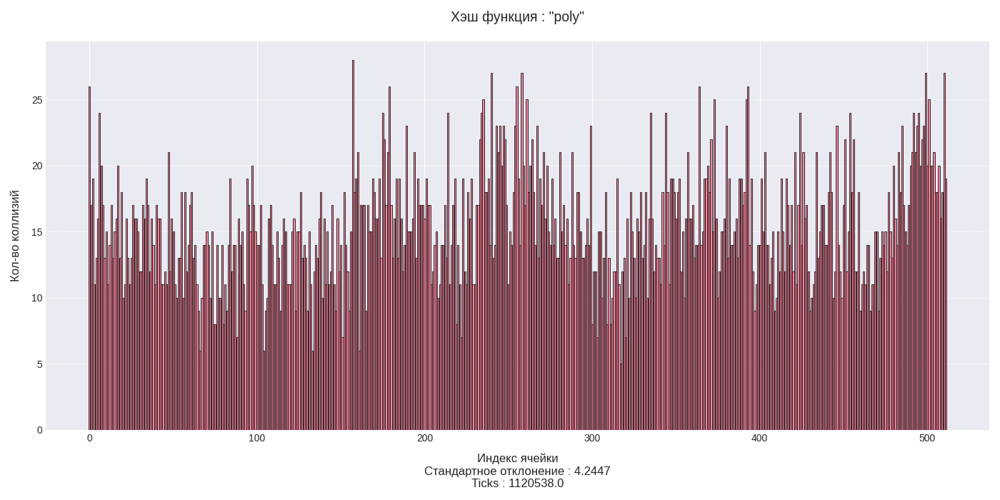
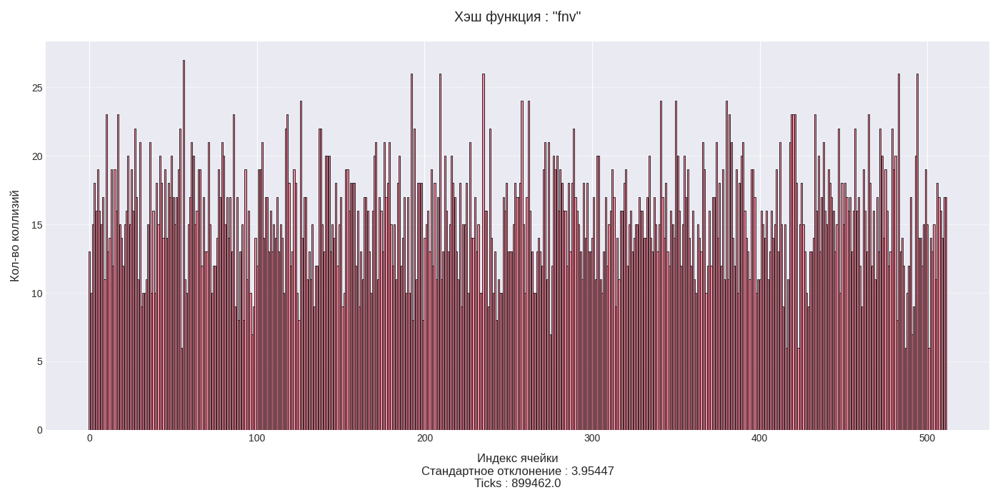

# Оптимизация работы хэш-таблицы с использованием профилирования

## Аннотация
В данной работе исследуются приемы оптимизации хеш-таблицы, реализованной методом цепочек. Основная цель — выявить «горячие» участки кода с помощью профилирования и улучшить их производительность за счет использования низкоуровневых техник, таких как ассемблерные вставки, `intrinsics`, реализация функций на `nasm`.

Оптимизации будут проводиться итеративно. Всего будет проведено 5 оптимизаций, за каждую из которых отвечает своя версия проекта `VERSION_0`, `VERSION_2`, ... , `VERSION_4`

## Среда и интрументы
* __Процессор:__ Intel Core i5-10300H 2.5GHz
* __Компилятор:__ g++ 13.3.0
* __Среда:__ Ubuntu 24.04
* __Инструменты профилирования:__ perf, hotspot
* __Сборка:__ makefile, python

## Входные данные
Перед началом тестирования хэш таблицы требуется сгенерировать входные данные. В качестве исходника для входных данных был взят текст романа Л. Н. Толстого "Война и мир", находящийся в файле `war_and_peace.txt`.

Подготовленными входными данными являются:
* Список слов для загрузки в хэш таблицу `text.txt`
* Список слов для тестирования хэш таблицы `tests.txt`

Для исследования оптимизаций хэш-таблицы установим:
* Длину каждого списка из входных данных в `40000` слов
* Размер хэш-таблицы в `512` ячеек

Данные константы были подобраны для того, чтобы `load factor` хэш-таблицы был равен `≈15`. В реальности для данное значение `load factor` слишком велико и может привести к длительному линейному поиску в односвязном списке. В данной работе `load factor` был взят неоптимальным специально для возможности применения эффективных оптимизации к функции `strncmp` и достоверного исследования хеш-функции на частоту коллизий.

Для генерации входных данных используйте команду:

```bash
    python3 run.py gen_tests
```

После выполнения команды будет создана папка `data` с файлами `text.txt` и `tests.txt` с необходимыми входными данными.


## Бенчмаркинг версий
Для измерения времени работы всех версий проекта (`VERSION_1` - `VERSION_5`) исполните команду
```bash
    python3 run.py versions_benchmarks <кол-во измерений на версию>
```
По умолчанию кол-во измерений на версию равно 20

После выполнения команды в папке `results` появится папка `versions_benchmark.out` с результатами бенчмаркинга с учетом погрешности ($x_{mean} ± 	\sigma_{x_{mean}}$). При расчете использовались формулы:

$$x_{mean} = \frac{\Sigma_{1}^{N}x_i}{n} $$

$$s = \sqrt{\frac{1}{N - 1}\Sigma_{1}^{N}(x_i - x_{mean})^2}$$

$$\sigma_{x_{mean}} = \frac{s}{\sqrt{N}}$$

$$\sigma_{x_{mean}} = \frac{s}{\sqrt{N}}$$

Рядом с результатом измерения будет выведена информация об абсолютной погрешности:
`(error : XX.XX%)`. Для уменьшения относительной погрешности рекомендуется увеличить `<кол-во измерений на версию>`


## Исследование функций хэширования
Перед началом процесса оптимизации рассмотрим несколько хэш-функций и отберем самую лучшую.
Все хэш-функции имеют сигнатуру
```c++
uint64_t hash_function(char *key_32b, const size_t len);
```
Выбор самой лучшей хэш-функции будет определятся несколькими критериями:
* __Величина стандартного расредления коллизий__. Чем меньше величина, тем равномернее будут распределяться значения по хэш-таблице, что будет способствовать ускорению поиска значений.
* __intrinsic Поддержка__. Для некоторых хэш-функций были созданы `intrinsics`, использование которых значительно ускоряет их работу.

### Хэш-функция : "Первый символ"
__Реализация__
```c++
uint64_t first_char_hash_func(char *key, const size_t len) {
    return (uint64_t) key[0];
}
```


__Стандартное отклонение__ : 71.08

Функция не покрывает весь диапазон значений. Большинство значений приходятся на промежуток `[50, 130]`. Не смотря на свою большую скорость, функция неэффективна из-за плохого распределения своих значений.


### Хэш-функция : "Полиномиальная"
__Реализация__
```c++
uint64_t polynom_hash_func(char *key, const size_t len) {
    uint64_t hash = 0;
    for (size_t i = 0; i < len; i++) {
        hash = (hash * 255 + (uint64_t) key[i]) % (1e9 + 7);
    }
    return hash;
}
```


__Стандартное отклонение__ : 3.96

Функция достаточно хорошо покрывает весь диапазон значений, но у неё `intrinsic` поддержки.


### Хэш-функция : "FNV (Fowler–Noll–Vo)"

__Реализация__
```c++
uint64_t fnv1a_hash(char *key, const size_t len) {
    const uint64_t FNV_prime = 0x01000193;
    uint64_t hash = 0x811C9DC5;
    const uint8_t *bytes = (const uint8_t *) key;

    for (size_t i = 0; i < len; i++) {
        hash ^= bytes[i];
        hash *= FNV_prime;
    }
    return hash;
}
```


__Стандартное отклонение__ : 3.92

Хорошая с точки зрения распределения хэш-функция. Есть `intrinsic` поддержка.


### Хэш-функция : "CR32"

Реализация
```c++
uint64_t crc32_hash_func(char *key, const size_t len) {
    const uint64_t CR32_POLY = 0x04C11DB7;
    const unsigned char *buffer = (const unsigned char*) key;
    uint64_t crc = (uint64_t) -1;

    for (size_t i = 0; i < len; i++) {
        crc = crc ^ (uint64_t) (*buffer++ << 24);
        for( int bit = 0; bit < 8; bit++ )
        {
            if( crc & (1L << 31)) crc = (crc << 1) ^ CR32_POLY;
            else                  crc = (crc << 1);
        }
    }

    return ~crc;
}
```


__Стандартное отклонение__ : 4.07

Обладает распределением чуть хуже `FNV` функции, но поддерживает `intrinsic` реализацию.

### Хэш-функция : "CR32_intrinsic"
Забегая немного вперед, покажу потенциал `intrinsic` реализации функции `CR32`, тем самым обосновав ее дальнейший выбор.

__Реализация__
```c++
uint64_t crc32_intrinsic_hash_func(char *key, const size_t len __attribute__((unused))) {
    uint64_t crc = 0;

    crc = _mm_crc32_u64(crc, *(uint64_t*) key + 0);
    crc = _mm_crc32_u64(crc, *(uint64_t*) key + 1);
    crc = _mm_crc32_u64(crc, *(uint64_t*) key + 2);
    crc = _mm_crc32_u64(crc, *(uint64_t*) key + 3);

    return crc;
}
```


__Стандартное отклонение__ : 4.66
Обладает не самым хорошим распределением, но выйгрывает за счет скорости.


## Итоговые результаты сравнения
Хэш функции были протестированы на входных данных с флагом компиляции `-O3`

Хэш-функция         |   ticks   | стандартное отклонение
--------------------|-----------|-----------------------
cr32_intrinsic      | 235224    | 4.66
cr32                | 19512686  | 4.07
fchar               | 195208    | 71.08
fnv                 | 1859450   | 3.92
poly                | 7821120   | 3.96

Эффективнее всего показала себя хэш-функция `cr32_intrinsic`. Поэтому в дальнейшем будем использовать именно ее.

## Оптимизации хэш-таблицы
### VERSION_0

Стартовая версия без оптимизаций. Хэш таблица реализована на `non-chache-friendly` односвязных списках. Спефика входных данных не учтена.
Вместо `cr32_intrinsic` выбрана хэш-функция `cr32`, чтобы при дальнейшем анализе показать, что неэффективная реализация хэш-функции может быть узким местом во всей программе.

Флаги компиляции: `-O0 -march=native`

__Результаты__

Версия    |Ticks                                        |Ускорение относительно предыдущей версии|
----------|---------------------------------------------|----------------------------------------|
VERSION_0 |342008758.5 ± 4597508.04017                  |                                        |

__Flame graph__

Действительно, хэш-функция `cr32` оказалась самым узким местом программы.

__Perf hist__


### VERSION_1
Отличие от предыдущей версии состоит в наличии стандратных оптимизаций, действующих при комипляции с флагами `-O3 -mtune=native`.

Флаги компиляции: `-O3 -march=native -mtune=native`

__Результаты__

Версия    |Ticks                                        |Ускорение относительно предыдущей версии|
----------|---------------------------------------------|----------------------------------------|
VERSION_0 |342008758.5 ± 4597508.04017                  |            --                          |
VERSION_1 |61200123.2 ± 749884.90514                    |         82.11% ± 0.46%                 |

__Flame graph__


__Perf hist__


При анализе `Perf hist` было замечено, что компилятор ускорил хэш-функцию `cr32` более чем на 30%.
Изучим техники, примененные компилятором при данной оптимизации

__godbolt template__ : https://godbolt.org/z/8xsj9Mqz3

Первой техникой компилятора было скоращение работы с памятью. В неоптимизированном ассемблерном коде наблюдается частое использование переменных, хранящихся на стековом фрейме в то время, как оптимизированная версия его не использует.


Второй техникой была развертка внутреннего цикла.


Данная техника способствовала уменьшению `branch-misses` на 15%.


### VERSION_2
Не смотря на компиляторные оптимизации, примененные в `VERSION_1`, хэш-функция `cr32` по-прежнему остается самым узким местом программы. В `VERSION_2` воспользуемся `intrinsic` реализацией функции `cr32`.

__Результаты__
Версия    |Ticks                                        |Ускорение относительно предыдущей версии|
----------|---------------------------------------------|----------------------------------------|
VERSION_0 | 342008758.5 ± 4597508.04017                 |            --                          |
VERSION_1 | 61200123.2 ± 749884.90514                   |         82.1% ± 0.5%                   |
VERSION_2 | 18481990.2 ± 458314.9905                    |         69.8% ± 1.1%                   |


__Perf hist__


Анализ `perf hist` показал, что примененная оптимизация дала ощутимый эффект: `cr32` стала занимать всего `2.41% overhead`. Теперь стандратная функция `strncmp_avx2` является узким местом программы с `30.12% overhead`.

### VERSION_3
Напишем свою функцию `streq_32b` на ассемблере и воспользуемся ею в текущей версии.
Реализация `streq_32b` опиралась на специфику входных данных (все слова имеют длину <= 32). В ней строки загружаются в вектора `ymm` по 256 байт и сравниваются одной ассемблерной инструкцией `vpcmpeqb`. Важной деталью реализации является использование инструкции `vmovdqa`, работающей с выравненными по 32 байта данными.

__Реализация__
```nasm
section .text
global streq_32b
streq_32b:
    xor rax, rax

    vmovdqa ymm0, YWORD [rdi]
    vptest ymm0, YWORD [rsi]

    seta al
    ret

```

__Результаты__
Версия    |Ticks                                        |Ускорение относительно предыдущей версии|
----------|---------------------------------------------|----------------------------------------|
VERSION_0 | 342008758.5 ± 4597508.04017                 |            --                          |
VERSION_1 | 61200123.2 ± 749884.90514                   |         82.1% ± 0.5%                   |
VERSION_2 | 18481990.2 ± 458314.9905                    |         69.8% ± 1.1%                   |
VERSION_3 | 15052046.46667 ± 278157.57937               |         18.6% ± 3.5%                   |


__Perf hist__


Было получено ускорение функции сравнения строк более чем на `8%`. Но несмотря на это, она по-прежнему остается самой горячей. Попробуем исправить это в следующей версии.
