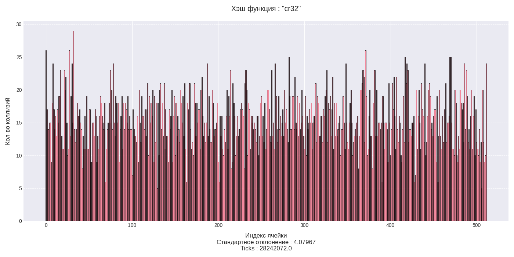

# Оптимизация работы хэш-таблицы с использованием профилирования


## Содержание
- [Аннотация](#аннотация)
- [Среда и инструменты](#среда-и-инструменты)
- [Входные данные](#входные-данные)
- [Исследование функций хэширования](#исследование-функций-хэширования)
- [Бенчмаркинг версий](#бенчмаркинг-версий)

- [Результаты и обсуждение](#результаты-и-обсуждение)
- [Заключение](#заключение)


## Аннотация
Хэш-таблица - это структура данных, позволяющая хранить пары (ключ, значение) и выполнять три операции: операцию добавления новой пары, операцию поиска и операцию удаления пары по ключу. В данной работе была реализована хэш-таблица с разрешение коллизий с помощью цепочек. Структура таблицы представляет из себя массив односвязных списков, в каждой вершине которого хранятся пары (ключ, значение). При добавлении новой пары благодаря хэш-функции ключ преобразуется в индекс массива. При хэшировании ключа возможно возникновение __коллизии__ - ситуации, в которой двум различным ключам сопоставляется одна ячейка массива. В этом случае производится проход по односвязному списку, находящемуся в данной ячейке массива, и явное сравнение ключей вершин списка и добавляемого ключа. При отсутствия совпадения, новая пара добавляется в конец односвязного списка.
Принцип работы операции поиска схож с принципом операцией добавления, за исключением того, что при обнаружении совпадения в проходе по односвязному списку возвращается найденная вершина.

Структура хэш таблицы:
```c++

struct list_node_t {
    char *key;
    list_node_t* next;
};

struct hash_table_32b_t {
    size_t sz;
    hash_function_t hash_function;
    list_node_t **data;
};
```

Реализация функции


В данной работе исследуются приемы оптимизации хеш-таблицы, реализованной методом цепочек. Основная цель — выявить «горячие» участки кода с помощью профилирования и улучшить их производительность за счет использования низкоуровневых техник, таких как ассемблерные вставки, `intrinsics`, реализация функций на `nasm`.


Оптимизации будут проводиться итеративно. Каждая новая версия проекта будет включать в себя оптимизации предыдущей:
* `v1` - версия без оптимизаций
* `v2` - версия с оптимизациями компилятора
* `v3` - версия с intrinsic оптимизацией функции cr32
* `v4` - версия с использованием собственной реализацией функции streq на ассемблере
* `v5` - версия с использованием inline функции streq с ассемблерными вставками


## Среда и инструменты
* __Процессор:__ Intel Core i5-10300H 2.5GHz
* __Компилятор:__ g++ 13.3.0
* __Среда:__ Ubuntu 24.04
* __Инструменты профилирования:__ perf, hotspot
* __Сборка:__ makefile, python


## Входные данные
Перед началом тестирования хэш таблицы требуется сгенерировать входные данные. В качестве исходника для входных данных был взят текст романа Л. Н. Толстого "Война и мир", находящийся в файле `war_and_peace.txt`.

Подготовленными входными данными являются:
* Список слов для загрузки в хэш таблицу `text.txt`
* Список слов для тестирования хэш таблицы `tests.txt`

Для исследования оптимизаций хэш-таблицы установим:
* Длину каждого списка из входных данных в `40000` слов
* Размер хэш-таблицы в `512` ячеек

Данные константы были подобраны для того, чтобы `load factor` хэш-таблицы был равен `≈15`. В реальности данное значение `load factor` слишком велико и может привести к длительному линейному поиску в односвязном списке. В данной работе `load factor` был взят неоптимальным в учебных целях : для возможности применения эффективных оптимизации к функции `strncmp` и достоверного исследования хеш-функции на частоту коллизий.

Для генерации входных данных используйте команду:

```bash
    python3 run.py gen_tests
```

После выполнения команды будет создана папка `data` с файлами `text.txt` и `tests.txt` с необходимыми входными данными.

## Ход работы и методика измерений

1) __Профилирование__
   Профилирование выполняется с помощью `perf` с флагами:
    ```bash
    perf record -g --call-graph dwarf -e branch-misses,cache-misses,instructions,cycles -T -F 100000 -- <исполняемый файл> <флаги исполняемого файла>
    ```
* Для увеличения количества `samples` рекомендуется добавить в <флаги исполняемого файла> : `--runs=10`
* `-g` - включает запись call graph для каждого семпла
* `--call-graph dwarf` - выбирает технологию `dwarf` сбора данных для `--call-graph`. При выборе `dwarf` `perf` дополнительно к исполняемой программе поддерживает стековую память самостоятельно. Эта технология имеет ограничение на глубину стека и требует больше ресурсов, __но__ позволяет анализировать программы, в которых в целях оптимизации не всегда создается стековый фрейм (см. `-fno-omit-frame-pointer`).
* `-T | --timestamp` - записывает временные метки (таймстемпы) для каждого семпла. Это позволяет в дальнейшем выводить точное время появления каждого события (например, с помощью perf report -D)
* `-F | --freq` - задаёт частоту семплирования — количество семплов в секунду

2) __Анализ `perf hist`__
    Для анализа `perf hist` используется команда
    ```bash
    perf report --call-graph fractal,caller -i <путь до perf.data>
    ```
* fractal — формат, в котором проценты нормализуются относительно каждого родителя (каждая ветка дерева рассматривается отдельно). Используется этот формат, чтобы оценить влияние оптимизируемых функций только на измеряемую часть работы хэш-таблицы (`поиск`), а не на всю работу программы целиком.
* caller — порядок отображения "родитель → потомок"


3) __Разогрев (Warm‑up):__ перед основными измерениями выполняется серия холостых вызовов функции find_key (параметр выставляется в configs/benchmarks.yaml) для исключения влияния первого запуска и кэш-прогрева.

4) __Основные замеры:__ для каждой версии проекта выполняется N повторов (repeats), заданных в configs/benchmarks.yaml


5) __Обработка результатов__
 Результаты бенчмаркинга с учетом погрешности ($x_{mean} ± 	\sigma_{x_{mean}}$). Выбросы были убраны по правилу $3‑σ$.
При расчете использовались формулы:

$$x_{mean} = \frac{\Sigma_{1}^{N}x_i}{n} $$

$$s = \sqrt{\frac{1}{N - 1}\Sigma_{1}^{N}(x_i - x_{mean})^2}$$

$$\sigma_{x_{mean}} = \frac{s}{\sqrt{N}}$$

Рядом с результатом измерения будет выведена информация об абсолютной погрешности:
`(error : XX.XX%)`. Для уменьшения относительной погрешности рекомендуется увеличить `<кол-во измерений на версию>`


## Исследование функций хэширования
Перед началом процесса оптимизации рассмотрим несколько хэш-функций и отберем самую лучшую.
Все хэш-функции имеют сигнатуру
```c++
uint64_t hash_function(char *key_32b, const size_t len);
```
Выбор самой лучшей хэш-функции будет определятся несколькими критериями:
* __Величина стандартного распределения коллизий__. Чем меньше величина, тем равномернее будут распределяться значения по хэш-таблице, что будет способствовать ускорению поиска значений.
* __intrinsic Поддержка__. Для некоторых хэш-функций были созданы `intrinsics`, использование которых значительно ускоряет их работу.

### Хэш-функция : "Первый символ"
__Реализация__
```c++
uint64_t first_char_hash_func(char *key, const size_t len) {
    return (uint64_t) key[0];
}
```


FIXME: вставлять картинки через html (33%-50%)
__Стандартное отклонение__ : 71.08

Функция не покрывает весь диапазон значений. Большинство значений приходятся на промежуток `[50, 130]`. Не смотря на свою большую скорость, функция неэффективна из-за плохого распределения своих значений.


### Хэш-функция : "Полиномиальная"
__Реализация__
```c++
uint64_t polynom_hash_func(char *key, const size_t len) {
    uint64_t hash = 0;
    for (size_t i = 0; i < len; i++) {
        hash = (hash * 255 + (uint64_t) key[i]) % (1e9 + 7);
    }
    return hash;
}
```

__График__


__Стандартное отклонение__ : 3.96

Функция достаточно хорошо покрывает весь диапазон значений, но у неё `intrinsic` поддержки.


### Хэш-функция : "FNV (Fowler–Noll–Vo)"

__Реализация__
```c++
uint64_t fnv1a_hash(char *key, const size_t len) {
    const uint64_t FNV_prime = 0x01000193;
    uint64_t hash = 0x811C9DC5;
    const uint8_t *bytes = (const uint8_t *) key;

    for (size_t i = 0; i < len; i++) {
        hash ^= bytes[i];
        hash *= FNV_prime;
    }
    return hash;
}
```


__Стандартное отклонение__ : 3.92

Хорошая с точки зрения распределения хэш-функция. Есть `intrinsic` поддержка.


### Хэш-функция : "CR32"

__Реализация__
```c++
uint64_t crc32_hash_func(char *key, const size_t len) {
    const uint64_t CR32_POLY = 0x04C11DB7;
    const unsigned char *buffer = (const unsigned char*) key;
    uint64_t crc = (uint64_t) -1;

    for (size_t i = 0; i < len; i++) {
        crc = crc ^ (uint64_t) (*buffer++ << 24);
        for( int bit = 0; bit < 8; bit++ )
        {
            if( crc & (1L << 31)) crc = (crc << 1) ^ CR32_POLY;
            else                  crc = (crc << 1);
        }
    }

    return ~crc;
}
```

__График__


__Стандартное отклонение__ : 3.87

Обладает распределением чуть хуже `FNV` функции, но поддерживает `intrinsic` реализацию.

### Хэш-функция : "CR32_intrinsic"
Забегая немного вперед, покажу потенциал `intrinsic` реализации функции `CR32`, тем самым обосновав ее дальнейший выбор.

__Реализация__
```c++
uint64_t crc32_intrinsic_hash_func(const char key[], const size_t len __attribute__((unused))) {
    uint64_t res = 0;

    uint64_t key_vec_u64_0 = 0;
    uint64_t key_vec_u64_1 = 0;
    uint64_t key_vec_u64_2 = 0;
    uint64_t key_vec_u64_3 = 0;

    memcpy(&key_vec_u64_0, key + 0, 8);
    memcpy(&key_vec_u64_1, key + 1, 8);
    memcpy(&key_vec_u64_2, key + 2, 8);
    memcpy(&key_vec_u64_3, key + 3, 8);

    res = _mm_crc32_u64(res, key_vec_u64_0);
    res = _mm_crc32_u64(res, key_vec_u64_1);
    res = _mm_crc32_u64(res, key_vec_u64_2);
    res = _mm_crc32_u64(res, key_vec_u64_3);

    return res;
}
```


__Стандартное отклонение__ : 4.36
Обладает не самым хорошим распределением, но выигрывает за счет скорости.


## Итоговые результаты сравнения
Хэш функции были протестированы на входных данных с флагом компиляции `-O3`.
FIXME: обновить таблицу

Хэш-функция         |   ticks   | стандартное отклонение
--------------------|-----------|-----------------------
cr32_intrinsic      | 196206    | 4.36
cr32                | 3815774   | 3.79
fchar               | 258512    | 71.08
fnv                 | 2216100   | 3.92
poly                | 8360760   | 3.96


Эффективнее всего показала себя хэш-функция `cr32_intrinsic`. Поэтому в дальнейшем будем использовать именно ее.

## Оптимизации хэш-таблицы
Перед началом оптимизации хэш-таблицы ознакомимся с основными флагами для профилирования, которые я буду в дальнейшем использовать.

### Версия `v1`

`Compile flags:` `-O0 -march=native -D NDEBUG`

`Launch flags:` `--hash=cr32`

В учебных целях измерим время работы версии v1 несмотря на отсутствие компиляторных оптимизаций.


__Результаты__
Версия | Ticks  (средн. ± σ)  | Порядок | Ускорение относительно предыдущей версии
-------|------------|---------|-------
v1	   | 1014   ± 2	| 4       | -

Стартовая версия без оптимизаций. Специфика входных данных не учтена.
Вместо `cr32_intrinsic` выбрана хэш-функция `cr32`, чтобы при дальнейшем анализе показать, что неэффективная реализация хэш-функции может быть узким местом во всей программе.

__Perf hist__


__Flame graph__


__Промежуточный вывод__

Действительно, хэш-функция `cr32` оказалась самым узким местом программы. Согласно `perf hist` ее вклад в измерения составляет ≈$93$%


### Версия `v2`
`Compile flags :` `-O3 -march=native -mtune=native -D NDEBUG `

`Launch flags :` `--hash=cr32`
Отличие от предыдущей версии состоит в наличии стандартных оптимизаций, действующих при компиляции с флагами `-O3 -mtune=native`.

__Результаты__

Версия | Ticks  (средн. ± σ)  | Порядок | Ускорение относительно предыдущей версии
-------|------------|---------|-------
v1	   | 1014   ± 2	| 4       | -
v2	   | 5 991  ± 1	| 3	      | 1,69×

__Perf hist__


При анализе ассемблерного кода после трансляции было замечено, что компилятор ускорил хэш-функцию `cr32`.
Изучим техники, примененные компилятором при данной оптимизации

__godbolt template__ : https://godbolt.org/z/8xsj9Mqz3

Первой техникой компилятора было сокращение работы с памятью. В ассемблерном коде `O0` наблюдается частое использование переменных, хранящихся на стековом фрейме в то время, как оптимизированная версия его не использует.


Второй техникой была развертка внутреннего цикла.


### Версия `v3`
`Compile flags :` `-O3 -march=native -mtune=native -D NDEBUG`

`Launch flags :` `--hash=cr32_intrinsic`

Не смотря на оптимизации компилятора, примененные в `v2`, хэш-функция `cr32` по-прежнему остается самым узким местом программы. В `v3` воспользуемся `intrinsic` реализацией функции `cr32`.

__Результаты__

Версия | Ticks  (средн. ± σ)  | Порядок | Ускорение относительно предыдущей версии
-------|------------|---------|-------
v1	   | 1014   ± 2	| 4       | -
v2	   | 5 991  ± 1	| 3	      | 1,69×
v3	   | 2 522  ± 9 | 3	      | 2,38×

__Perf hist__


Анализ `perf hist` показал, что примененная оптимизация дала __ощутимый эффект__: `cr32` стала занимать всего `2.34% overhead`. Теперь стандартная функция `strncmp_avx2` является узким местом программы с `56.89% overhead`.

### Версия `v4`
`Compile_flags :` `-O3 -march=native -mtune=native -D MY_STREQ -D NDEBUG`

`Launch_flags :` `--hash=cr32_intrinsic`

Напишем свою функцию `streq_32b` на ассемблере и воспользуемся ею в текущей версии.
Реализация `streq_32b` опиралась на специфику входных данных (все слова имеют длину <= 32). В ней строки загружаются в вектора `ymm` по 256 байт и сравниваются одной ассемблерной инструкцией `vpcmpeqb`.

> [!Warning]
> Для корректной работы функции `streq` строки должны быть выравнены по 32 байта, т.к. в реализации функции используется инструкция `vmovdqa`, работающая исключительно с выравненными по 32 байта данными.


__Реализация__
```nasm
global streq_32b

section .text

streq_32b:
    vmovdqa ymm0, [rdi]
    xor rax, rax
    vptest ymm0, [rsi]
    seta al

    ret
```

__Результаты__
Версия | Ticks  (средн. ± σ)  | Порядок | Ускорение относительно предыдущей версии
-------|------------|---------|-------
v1	   | 1014   ± 2	| 4       | -
v2	   | 5 991  ± 1	| 3	      | 1,69×
v3	   | 2 522  ± 9 | 3	      | 2,38×
v4	   | 1 577  ± 9 | 3	      | 1,60×

__Perf hist__


Было получено глобальное ускорение функции сравнения строк более чем на `8%`. Но несмотря на это, она по-прежнему остается самой горячей. Попробуем исправить это в следующей версии.

### Версия `v5`

`Compile flags :` `-O3 -march=native -mtune=native -masm=intel -D INLINE_ASM_STREQ -D NDEBUG`
`Launch flags :` `--hash=cr32_intrinsic`

Реализую inline версию функции `streq_32b` с помощью ассемблерных вставок.


__Реализация__
```c++
__attribute__((unused))
inline int streq_32b_inline(const char *str1, const char *str2) {
    int res = 0;
    __asm__(".intel_syntax noprefix\n"
            "vmovdqa ymm0, [%1]\n"
            "xor rax, rax\n"
            "vptest ymm0, [%2]\n"
            "seta al\n"

            : "=a"(res)
            : "r"(str1),
              "D"(str2)
            : "ymm0", "cc");

    return res;
}
```
В `perf annotate` видно, что произошел `inlining` функции `streq`.


__Результаты__
Версия | Ticks  (средн. ± σ)  | Порядок | Ускорение относительно предыдущей версии
-------|------------|---------|-------
v1	   | 1014   ± 2	| 4       | -
v2	   | 5 991  ± 1	| 3	      | 1,69×
v3	   | 2 522  ± 9 | 3	      | 2,38×
v4	   | 1 577  ± 9 | 3	      | 1,60×
v5	   | 1 551  ± 7 | 3	      | 1,02×

`Inline streq` дала незначительный прирост к скорости `2%`, поэтому было принято решение закончить цепочку оптимизаций.


# Заключение

## Итоговые результаты:
Версия | Ticks  (средн. ± σ)  | Порядок | Ускорение относительно предыдущей версии
-------|------------|---------|-------
v1	   | 1014   ± 2	| 4       | -
v2	   | 5 991  ± 1	| 3	      | 1,69×
v3	   | 2 522  ± 9 | 3	      | 2,38×
v4	   | 1 577  ± 9 | 3	      | 1,60×
v5	   | 1 551  ± 7 | 3	      | 1,02×

Итого, итоговая версия `v5` имеет ускорение в `3.86` раза относительно версии `v2`.


После процесса последовательных оптимизаций работа с хеш-таблицей была ускорена в `3.86` раз. Было продемонстрировано, что при должном понимании ограничений на входные данные появляется возможность проводить более агрессивные оптимизации, которые не может себе позволить компилятор. Также был показан ощутимый эффект применения ассемблерных оптимизаций.

В образовательных целях мы пренебрегли очень важным фактором скорости работы хеш-таблицы, ее `load factor`.
Но реальных проектах перед началом ассемблерных оптимизаций очень важно провести алгоритмический анализ. Ведь некоторые узкие в алгоритмическом смысле места могут быть нераспознаны к примеру профилировщиком.
